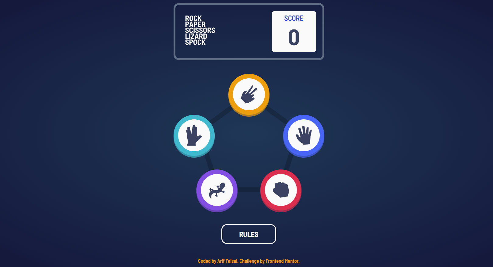

# Rock, Paper, Scissors +

The game is an extended version of the classic Rock, Paper, Scissors game. It also somes with two new elements- Lizard and Spock. This is a solution to the [Rock, Paper, Scissors challenge on Frontend Mentor](https://www.frontendmentor.io/challenges/rock-paper-scissors-game-pTgwgvgH).

## Table of contents

- [Overview](#overview)
  - [The challenge](#the-challenge)
  - [Screenshot](#screenshot)
  - [Links](#links)
- [My process](#my-process)
  - [Built with](#built-with)
  - [Continued development](#continued-development)
- [Author](#author)
- [Report bugs](#report-bugs)

## Overview

### The challenge

Users should be able to:

- View the optimal layout for the game depending on their device's screen size
- Maintain the state of the score after refreshing the browser.
- Play Rock, Paper, Scissors, Lizard, Spock against the computer/

### Screenshot

### Links

- Solution URL: [https://github.com/arifaisal123/frontend_projects/tree/main/frontend_challenges/rock_paper_scissors_plus](https://github.com/arifaisal123/frontend_projects/tree/main/frontend_challenges/rock_paper_scissors_plus)
- Live Site URL: [https://rockpaperscissors-plus.netlify.app](https://rockpaperscissors-plus.netlify.app)

## My process

### Built with

- Semantic HTML5 markup
- Flexbox
- Mobile-first workflow
- Vanilla JavaScript
- Sass

### Continued development

The following features are planned for future developments:
- 2-player version
- Classic version (Only Rock Paper Scissors)
- Sound Toggle On/ Off

## Author

- Website - [Arif Faisal](https://arifaisal123.github.io)
- Frontend Mentor - [@arifaisal123](https://www.frontendmentor.io/profile/arifaisal123)
- Twitter - [@faisalcodes123](https://www.twitter.com/faisalcodes123)

## Report bugs

Report any bugs that you encounter [here](https://arifaisal123.github.io/contact.html).
